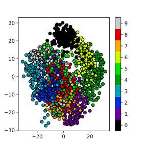
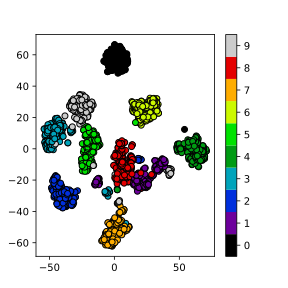
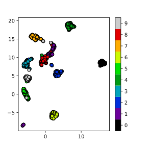

The script below compares PCA, t-SNE and UMAP for the MNIST digits dataset.

~~~
# https://scikit-learn.org/stable/auto_examples/decomposition/plot_pca_iris.html#sphx-glr-auto-examples-decomposition-plot-pca-iris-py
# https://scikit-learn.org/stable/auto_examples/applications/plot_face_recognition.html#sphx-glr-auto-examples-applications-plot-face-recognition-py
# https://scikit-learn.org/stable/auto_examples/cluster/plot_kmeans_digits.html#sphx-glr-auto-examples-cluster-plot-kmeans-digits-py
# https://scikit-learn.org/stable/auto_examples/manifold/plot_lle_digits.html#sphx-glr-auto-examples-manifold-plot-lle-digits-py
# https://umap.scikit-tda.org/basic_usage.html#digits-data

# SETUP
# pip3 install scikit-learn
# pip3 install umap-learn

import numpy as np
import matplotlib.pyplot as plt
import umap

from sklearn import decomposition
from sklearn import datasets
from sklearn import manifold

digits = datasets.load_digits()

# Examine the dataset

print(digits.data)
#print(digits.image[0])

print(digits.target)

X = digits.data
y = digits.target

# PCA
pca = decomposition.PCA(n_components=2)
pca.fit(X)
X_pca = pca.transform(X)

fig = plt.figure(1, figsize=(4, 4))
plt.clf()
plt.scatter(X_pca[:, 0], X_pca[:, 1], c=y, cmap=plt.cm.nipy_spectral, 
        edgecolor='k',label=y)
plt.colorbar(boundaries=np.arange(11)-0.5).set_ticks(np.arange(10))
plt.savefig("pca.svg")

# t-SNE embedding
tsne = manifold.TSNE(n_components=2, init='pca',
        random_state = 0)
X_tsne = tsne.fit_transform(X)
fig = plt.figure(1, figsize=(4, 4))
plt.clf()
plt.scatter(X_tsne[:, 0], X_tsne[:, 1], c=y, cmap=plt.cm.nipy_spectral,
        edgecolor='k',label=y)
plt.colorbar(boundaries=np.arange(11)-0.5).set_ticks(np.arange(10))
plt.savefig("tsne.svg")

# umap
reducer= umap.UMAP(n_components=2, n_neighbors=15,
   random_state=42, transform_seed=42, verbose=False)
reducer.fit(digits.data)

X_umap = reducer.transform(digits.data)

fig = plt.figure(1, figsize=(4, 4))
plt.clf()
plt.scatter(X_umap[:, 0], X_umap[:, 1], c=y, cmap=plt.cm.nipy_spectral,
        edgecolor='k',label=y)
plt.colorbar(boundaries=np.arange(11)-0.5).set_ticks(np.arange(10))
plt.savefig("umap.svg")
~~~
{: .python}

